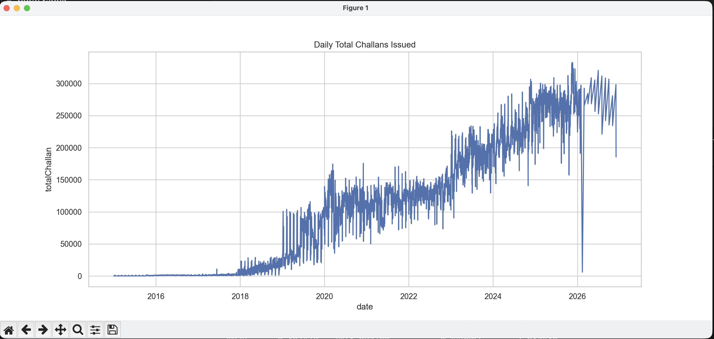
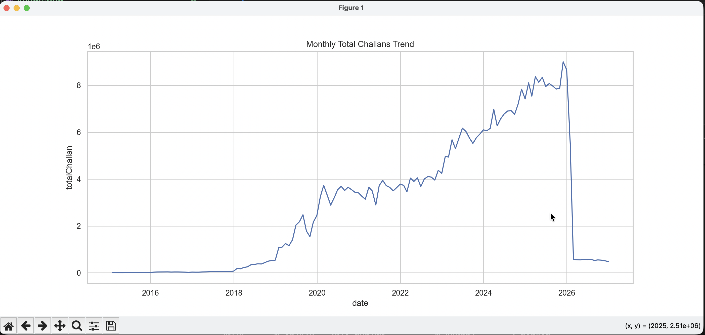
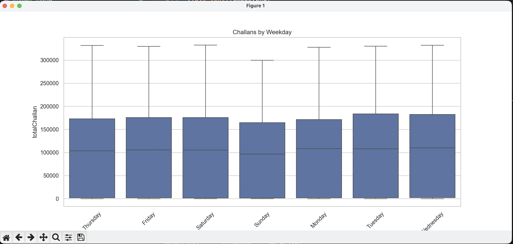
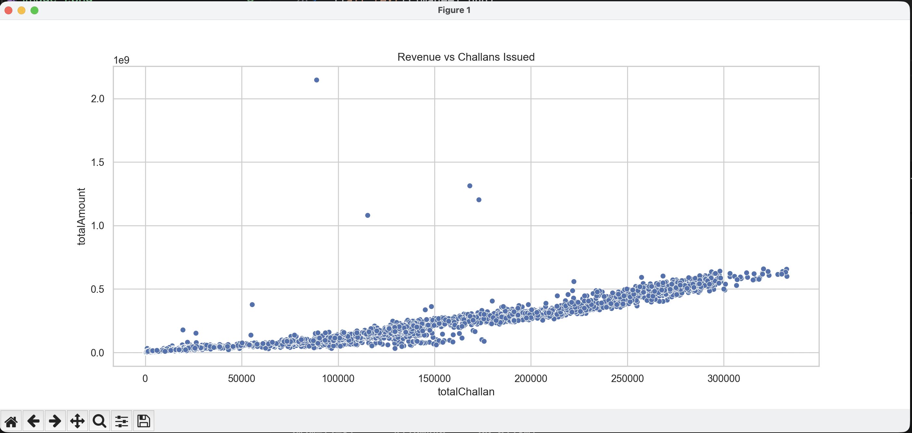

Indian Traffic E-Challan Daily Dataset (2015–2026) 

About Dataset 
Context 
This dataset provides a daily granularity of traffic challan (fine) issuance and collection across India. The data is sourced from the Parivahan E-Challan system, which is the centralized digital traffic enforcement solution used by the Government of India. It captures the volume of traffic violations, the financial value of these fines, and their settlement status (paid vs. pending vs. court). 

----------------------------------------------------------

If you have installed poetry simply run the program using followng command
-> "poetry run python sample.py"

Dataset Info:
<class 'pandas.DataFrame'> 
RangeIndex: 4061 entries, 0 to 4060 
Data columns (total 10 columns): 
 #   Column           Non-Null Count  Dtype 
---  ------           --------------  -----
 0   date             4061 non-null   datetime64[us] 
 1   totalChallan     4061 non-null   int64 
 2   disposedChallan  4061 non-null   int64 
 3   pendingChallan   4061 non-null   int64 
 4   pendingAmount    4061 non-null   int64 
 5   disposedAmount   4061 non-null   int64 
 6   totalAmount      4061 non-null   int64 
 7   pendingCourt     4061 non-null   int64 
 8   disposedCourt    4061 non-null   int64 
 9   totalCourt       4061 non-null   int64 
dtypes: datetime64[us](1), int64(9) 
memory usage: 317.4 KB 
None 

